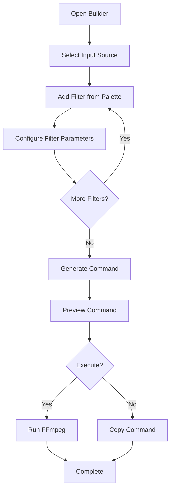
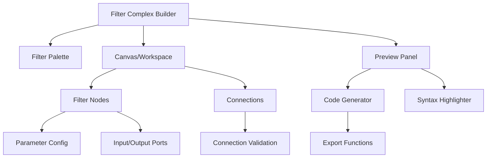
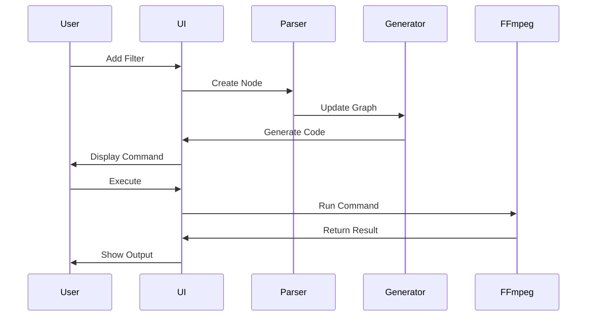

# Filter Complex Builder UX Specification

## Overview

The Filter Complex Builder is a visual tool for constructing FFmpeg `-filter_complex` commands. It provides a drag-and-drop interface for building complex filter graphs, making it easier for users to create advanced video processing workflows without manually writing filter graph syntax.

## User Personas

### Primary Persona: Intermediate FFmpeg User
- Has basic FFmpeg knowledge
- Wants to create complex filter graphs
- Struggles with filter_complex syntax
- Needs visual feedback to understand filter relationships

### Secondary Persona: Video Editor
- Familiar with video editing concepts
- Needs to apply multiple effects
- Prefers visual interfaces over command-line
- Wants to see results quickly

## User Goals

1. **Build complex filter graphs visually** without writing syntax manually
2. **Understand filter relationships** through visual representation
3. **Test filter combinations** quickly before final encoding
4. **Learn filter_complex syntax** through visual-to-code translation
5. **Reuse filter graphs** for batch processing

## User Flows

### Flow 1: Creating a Simple Filter Chain

```
1. User opens Filter Complex Builder
2. User selects input source(s)
3. User drags "scale" filter from palette
4. User configures scale parameters (1280:720)
5. User drags "blur" filter
6. System auto-connects blur to scale output
7. User configures blur parameters
8. User clicks "Generate Command"
9. System displays generated filter_complex string
10. User can copy or execute command
```

### Flow 2: Creating Parallel Filter Paths

```
1. User opens Filter Complex Builder
2. User adds input source
3. User adds "split" filter (creates 2 outputs)
4. User adds "blur" filter connected to split[0]
5. User adds "sharp" filter connected to split[1]
6. User adds "overlay" filter with 2 inputs
7. User connects blur and sharp outputs to overlay
8. System generates complex filter graph
9. User previews result
```

### Flow 3: Learning from Examples

```
1. User views tutorial lesson with filter graph
2. User clicks "Try in Builder" button
3. Filter graph loads into builder
4. User can modify filters and see code update
5. User learns syntax through visual-to-code mapping
```

## Component Architecture

### Main Components

1. **Filter Palette**
   - Sidebar with common filters
   - Categorized by type (video, audio, effects)
   - Search functionality
   - Filter descriptions and examples

2. **Canvas/Workspace**
   - Drag-and-drop area
   - Visual filter graph representation
   - Zoom and pan controls
   - Grid/snap-to-grid option

3. **Filter Nodes**
   - Visual representation of filters
   - Input/output ports
   - Parameter configuration panel
   - Delete/duplicate actions

4. **Connection System**
   - Visual connections between nodes
   - Stream label display
   - Connection validation
   - Auto-routing for clean layouts

5. **Code Generator**
   - Real-time code generation
   - Syntax validation
   - Formatting options
   - Export functionality

6. **Preview Panel**
   - Command preview
   - Syntax highlighting
   - Copy to clipboard
   - Execute test command

### Data Model

```typescript
interface FilterNode {
  id: string;
  type: string;
  label?: string;
  parameters: Record<string, any>;
  inputs: string[]; // Stream labels or node IDs
  outputs: string[]; // Stream labels
  position: { x: number; y: number };
}

interface FilterConnection {
  id: string;
  from: string; // Node ID or stream label
  to: string; // Node ID
  streamLabel?: string;
}

interface FilterGraph {
  nodes: FilterNode[];
  connections: FilterConnection[];
  inputs: string[]; // Input sources
  outputs: string[]; // Output labels
}
```

## Interaction Patterns

### Adding Filters

**Method 1: Drag from Palette**
- User drags filter from palette
- Drops onto canvas
- Filter node appears at drop location
- Auto-connects to previous filter if applicable

**Method 2: Double-click Palette**
- User double-clicks filter in palette
- Filter appears at center of canvas
- User can drag to reposition

**Method 3: Context Menu**
- User right-clicks canvas
- Context menu shows "Add Filter"
- Submenu shows filter categories
- User selects filter

### Connecting Filters

**Method 1: Drag Connection**
- User clicks output port of source filter
- Drags to input port of target filter
- Connection line appears
- Release to create connection

**Method 2: Auto-connect**
- User adds new filter
- System suggests connections
- User confirms or modifies

**Method 3: Stream Label**
- User manually enters stream label
- System validates label exists
- Auto-creates connection

### Configuring Filters

**Inline Editing**
- Click filter node to select
- Parameter panel appears
- Edit parameters directly
- Code updates in real-time

**Form-based Editing**
- Double-click filter node
- Modal/form opens
- User fills in parameters
- Apply changes

### Visual Feedback

**Hover States**
- Filter nodes highlight on hover
- Connection paths highlight
- Ports show connection points
- Tooltips show filter info

**Selection States**
- Selected node highlighted
- Parameters panel shows
- Delete/duplicate buttons appear
- Connection handles visible

**Validation States**
- Valid connections: green
- Invalid connections: red
- Missing parameters: yellow warning
- Error messages inline

## Visual Design

### Color Scheme

- **Background**: Dark gray (#1a1a1a)
- **Canvas**: Slightly lighter gray (#252525)
- **Filter Nodes**: Purple (#8b5cf6) with variations
- **Connections**: Purple (#a855f7)
- **Input Nodes**: Green (#10b981)
- **Output Nodes**: Blue (#3b82f6)
- **Text**: White/light gray
- **Errors**: Red (#ef4444)
- **Warnings**: Yellow (#fbbf24)

### Typography

- **Node Labels**: Bold, 14px
- **Parameters**: Regular, 12px
- **Code**: Monospace, 13px
- **Descriptions**: Regular, 11px

### Layout

```
┌─────────────────────────────────────────────────┐
│  Header: Filter Complex Builder                │
├──────────┬──────────────────────┬──────────────┤
│          │                      │              │
│ Filter   │   Canvas/Workspace   │  Preview     │
│ Palette  │                      │  Panel       │
│          │   [Filter Nodes]     │              │
│ - scale  │   [Connections]     │  Generated   │
│ - crop   │                      │  Command:    │
│ - blur   │                      │              │
│ - ...    │                      │  -filter_    │
│          │                      │  complex...  │
│          │                      │              │
│          │                      │  [Copy]      │
│          │                      │  [Execute]   │
└──────────┴──────────────────────┴──────────────┘
```

## Technical Requirements

### Performance

- Handle graphs with 50+ nodes smoothly
- Real-time code generation (<100ms)
- Smooth drag-and-drop interactions
- Efficient rendering of connections

### Browser Support

- Modern browsers (Chrome, Firefox, Safari, Edge)
- Canvas API for rendering
- Drag and Drop API
- Clipboard API for copy functionality

### Accessibility

- Keyboard navigation support
- Screen reader compatibility
- High contrast mode support
- Focus indicators

## Implementation Phases

### Phase 1: Basic Builder (MVP)
- Filter palette with common filters
- Simple node-based interface
- Basic connections
- Code generation for linear chains
- Copy to clipboard

### Phase 2: Advanced Features
- Parallel filter paths
- Split/merge operations
- Stream label management
- Parameter validation
- Syntax error detection

### Phase 3: Enhanced UX
- Drag-and-drop from palette
- Visual connection editor
- Auto-layout algorithms
- Zoom/pan controls
- Undo/redo functionality

### Phase 4: Integration
- Integration with command builder
- Tutorial lesson integration
- Example gallery
- Save/load filter graphs
- Export to JSON

## Success Metrics

- **Usability**: Users can create filter graphs without manual syntax
- **Learning**: Users understand filter_complex syntax better
- **Efficiency**: Faster filter graph creation vs manual coding
- **Error Reduction**: Fewer syntax errors in generated commands
- **Engagement**: Users return to use the builder

## Future Enhancements

1. **Filter Templates**: Pre-built common filter combinations
2. **Visual Preview**: Live preview of filter effects
3. **Performance Profiling**: Show estimated processing time
4. **Collaboration**: Share filter graphs with others
5. **AI Suggestions**: Suggest filter combinations based on goals
6. **Mobile Support**: Touch-optimized interface

## Mermaid Diagrams

### User Flow: Creating Filter Graph



### Component Architecture



### Filter Graph Data Flow



## Conclusion

The Filter Complex Builder provides an intuitive visual interface for creating complex FFmpeg filter graphs. By combining drag-and-drop interactions with real-time code generation, it makes advanced video processing accessible to users of all skill levels while serving as an educational tool for understanding filter_complex syntax.
